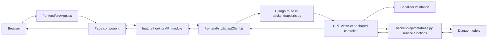

# Farm Insight Project Structure Guide

This document explains how the codebase is organized, what each maintained file is responsible for, and how the frontend and backend are connected.

The repository is still named `FarmersApp`, but the current user-facing product name in the UI is `Farm Insight`.

## How To Read This Document

- "Maintained files" means the source, config, seed, and documentation files that matter when changing behavior.
- Generated or dependency folders such as `frontend/node_modules`, `frontend/dist`, and Python `__pycache__` folders are intentionally excluded from detailed explanation.
- When a file is currently unused or looks like an older prototype, that is called out explicitly.

## Big Picture

The repo is a monorepo with two real applications:

- `frontend/`: a Vite + React app that renders the UI.
- `backend/`: a Django + Django REST Framework app that exposes JSON endpoints.

At a high level, the app works like this:

## Important Architectural Facts

- The frontend does not use React Router. Routing is manual and hash-based inside `frontend/src/App.jsx`.
- The frontend does not use a token-based auth system. Login/signup responses are stored directly in `localStorage`.
- The backend has no default DRF authentication classes enabled in `backend/config/settings.py`.
- Most backend business rules do not live inside the viewsets. They live in `backend/api/database.py`, which acts as a service layer.
- The frontend uses a feature-folder structure for plants, tasks, finance, inventory, and auth.
- The finance and inventory UIs are mostly "page-local": each page file contains many section components inside a single large file.
- The plants and tasks UIs are more modular: page files orchestrate many smaller components.

## Domain Model In Plain English

These are the main data relationships in the backend:

- A `User` is either a `manager` or `worker`.
- A `Farm` is the top-level operational workspace.
- A farm contains `Plot` and `Greenhouse` records.
- A `Plant` belongs to exactly one area: either one plot or one greenhouse.
- A `PlantStage` describes where a plant is in its lifecycle.
- A `Task` belongs to a plant, and therefore indirectly to a farm and an area.
- A task can have assignments, comments, history entries, and optional recurrence via `RecurringTaskPlan`.
- `ResourceUsageEntry` links resource consumption to a plant and optionally a task.
- `HarvestHistoryEntry` records harvests for a plant.
- `InventoryItem` belongs to a farm and category.
- `InventoryMovement` changes stock levels and can optionally link to a task or plant.
- Finance records are split across partners, categories, recurring expenses, expense records, sales deals, sales deliveries, and transactions.
- A `FinanceTransaction` is designed to point to exactly one source: either an `ExpenseRecord` or a `SalesDelivery`.

## End-To-End Flows

### Login flow

1. `frontend/src/features/auth/pages/AuthPages.jsx` submits credentials through `authApi`.
2. `frontend/src/features/auth/api/authApi.js` calls `frontend/src/lib/apiClient.js`.
3. `backend/api/urls.py` routes `/auth/login/` to `backend/api/modules/shared/controllers.py`.
4. The shared controller verifies the user and returns a slim user object plus farms.
5. `frontend/src/App.jsx` stores the selected session in `localStorage` under `farmersapp_session`.

### Manager task verification flow

1. `frontend/src/features/tasks/components/TaskStatusActions.jsx` shows available actions based on role and task status.
2. `frontend/src/features/tasks/pages/TasksPage.jsx` builds the payload and calls `tasksApi.confirmCompletion`.
3. `frontend/src/features/tasks/api/tasksApi.js` sends `POST /api/tasks/:id/confirm-completion/`.
4. `backend/api/modules/tasks/controllers.py` validates the request with `TaskStatusActionSerializer`.
5. `backend/api/database.py` runs `confirm_completion(...)`.
6. The updated task is serialized with `TaskDetailSerializer` and sent back to the UI.

### Inventory movement flow

1. `frontend/src/pages/InventoryPage.jsx` opens the movement drawer and collects movement data.
2. `frontend/src/features/inventory/api/inventoryApi.js` posts to `/inventory-movements/`.
3. `backend/api/modules/inventory/controllers.py` validates with `InventoryMovementWriteSerializer`.
4. `backend/api/database.py` calculates stock delta, blocks negative stock, updates the item quantity, and saves the movement.
5. The frontend refreshes dashboard, items, and movement history through `useInventory`.

## Repository Overview

### Root files

| File | Purpose |
| --- | --- |
| `README.md` | Original high-level setup guide for the monorepo. Good for quick start, but not detailed enough to explain the current code structure. |
| `.env.example` | Top-level environment example. Duplicates some backend settings for convenience. The backend itself actually loads `backend/.env`. |
| `.gitignore` | Root ignore rules for frontend build output, Python caches, local env files, IDE folders, and logs. |
| `PROJECT_STRUCTURE.md` | This documentation file. |

## Backend

### Backend startup and config files

| File | Purpose |
| --- | --- |
| `backend/manage.py` | Standard Django CLI entry point used for `runserver`, `migrate`, `test`, and custom commands. |
| `backend/requirements.txt` | Python dependencies: Django, DRF, CORS support, dotenv loading, and PostgreSQL driver. |
| `backend/.env.example` | Backend-specific environment template with Django and PostgreSQL values. |
| `backend/.env` | Local runtime configuration actually loaded by `backend/config/settings.py`. This is environment-specific and should be treated as sensitive configuration. |
| `backend/SAMPLE_DATA.md` | Explains how to run the demo data seed command and which demo credentials are created. |
| `backend/config/__init__.py` | Package marker for the Django config module. |
| `backend/config/settings.py` | Main Django settings file. Loads `.env`, configures PostgreSQL, CORS, the custom `api.User` model, and DRF defaults. |
| `backend/config/urls.py` | Root URL configuration. It delegates all API traffic to `api.urls` under `/api/`. |
| `backend/config/asgi.py` | Standard ASGI entry point for async deployments. |
| `backend/config/wsgi.py` | Standard WSGI entry point for traditional deployments. |

### Backend app shell files

| File | Purpose |
| --- | --- |
| `backend/api/__init__.py` | Package marker for the main API app. |
| `backend/api/apps.py` | Declares the Django app config for `api`. |
| `backend/api/admin.py` | Registers all major models in Django admin. Useful for manual inspection and debugging. |
| `backend/api/models.py` | Defines the custom `User` model and re-exports all module models so Django can discover them from one place. |
| `backend/api/serializers.py` | Thin aggregator that re-exports serializers from the feature modules. |
| `backend/api/urls.py` | Central API router. Registers all DRF viewsets and the shared auth/meta endpoints. |
| `backend/api/views.py` | Compatibility-style re-export of a few shared controller functions. It is not the main place where view logic lives. |
| `backend/api/tests.py` | Backend tests covering task listing/dashboard behavior and the sample data seed command. |
| `backend/api/database.py` | The core service layer. This is where most queries, filters, dashboards, stock calculations, task state changes, delete impacts, and recurring-task logic live. |

### Backend migrations and command files

| File | Purpose |
| --- | --- |
| `backend/api/migrations/__init__.py` | Package marker for Django migrations. |
| `backend/api/migrations/0001_initial.py` | Initial schema migration that creates the simplified project tables. |
| `backend/api/migrations/0002_seed_reference_data.py` | Seeds default farm and plant stages during migration. |
| `backend/api/management/__init__.py` | Package marker for Django management utilities. |
| `backend/api/management/commands/__init__.py` | Package marker for custom management commands. |
| `backend/api/management/commands/seed_demo_data.py` | Large demo-data generator. Creates a farm, users, plants, tasks, inventory, finance records, comments, and history for realistic local testing. |

### Backend shared module

| File | Purpose |
| --- | --- |
| `backend/api/modules/__init__.py` | Package marker for backend feature modules. |
| `backend/api/modules/shared/__init__.py` | Package marker for shared backend utilities. |
| `backend/api/modules/shared/controllers.py` | Non-viewset endpoints for API root, health check, login, signup, and `ui-meta`. This is the backend entry point for authentication and shared dropdown data. |
| `backend/api/modules/shared/serializers.py` | Contains `UserSlimSerializer`, the small user serializer reused across tasks, plants, finance, auth, and metadata responses. |

### Backend plants module

| File | Purpose |
| --- | --- |
| `backend/api/modules/plants/__init__.py` | Package marker. |
| `backend/api/modules/plants/models.py` | Defines `Farm`, `Plot`, `Greenhouse`, `PlantStage`, `Plant`, and `HarvestHistoryEntry`. This file establishes the farm/area/plant part of the domain model. |
| `backend/api/modules/plants/serializers.py` | Read and write serializers for farms, stages, plots, greenhouses, plants, harvest history, and resource usage. It also builds plant detail timelines and compact summaries used across the UI. |
| `backend/api/modules/plants/controllers.py` | DRF viewsets for plants, plots, greenhouses, harvest history, and resource usage. Adds custom actions like dashboard, stage change, mark failed, mark harvested, delete impact, and plant-specific history endpoints. |
| `backend/api/modules/plants/validators.py` | Validation helpers that enforce plant rules such as "exactly one area" and expected-harvest date ordering. |

### Backend tasks module

| File | Purpose |
| --- | --- |
| `backend/api/modules/tasks/__init__.py` | Package marker. |
| `backend/api/modules/tasks/models.py` | Defines recurring task plans, tasks, assignments, comments, history, and resource usage entries. This is the operational workflow core of the app. |
| `backend/api/modules/tasks/serializers.py` | Task list/detail/write serializers, assignment serializer, comment serializer, history serializer, and status-action serializer. It shapes most of the task payloads consumed by the frontend. |
| `backend/api/modules/tasks/controllers.py` | Task and recurring-series viewsets. Exposes dashboard, activity, comments, history, worker assignment, start, complete, confirm completion, postpone, cancel, and delete-impact actions. |
| `backend/api/modules/tasks/validators.py` | Small validation helpers for task time ordering and recurring task payload validity. |

### Backend inventory module

| File | Purpose |
| --- | --- |
| `backend/api/modules/inventory/__init__.py` | Package marker. |
| `backend/api/modules/inventory/models.py` | Defines inventory categories, items, and movements. Also links movements optionally to tasks and plants. |
| `backend/api/modules/inventory/serializers.py` | Serializes category, item, and movement data. Adds computed summaries like quantity state, latest movement, task summary, and plant summary. |
| `backend/api/modules/inventory/controllers.py` | Viewsets for categories, items, and movements. Adds item dashboard and delete-impact endpoints. |

### Backend finance module

| File | Purpose |
| --- | --- |
| `backend/api/modules/finance/__init__.py` | Package marker. |
| `backend/api/modules/finance/models.py` | Defines finance partners, expense categories, recurring expenses, expense records, sales deals, sales deliveries, and finance transactions. |
| `backend/api/modules/finance/serializers.py` | Serializes all finance entities, including compact task/plant/partner/farm summaries for UI consumption. |
| `backend/api/modules/finance/controllers.py` | Viewsets for finance partners, expense categories, recurring expenses, expense records, sales deals, sales deliveries, and transactions. Adds the finance dashboard action. |

### What `backend/api/database.py` is doing

This file is important enough to call out separately because it is not a normal "database connection file". It is really the backend's business-logic layer.

It is responsible for:

- building commonly reused querysets such as `plants_queryset()`, `tasks_queryset()`, and `inventory_items_queryset()`
- applying filters from query params for plants, tasks, inventory, finance, and movement lists
- calculating dashboard summaries for plants, tasks, inventory, and finance
- validating and applying inventory movement stock deltas
- creating, updating, postponing, cancelling, completing, and confirming tasks
- writing task history entries
- assigning workers to tasks
- building recurring task series from recurrence payloads
- computing delete-impact previews before destructive actions
- updating plant status and stage

If you need to trace backend behavior, `database.py` is usually the most important file after the relevant serializer and controller.

## Frontend

### Frontend build/config files

| File | Purpose |
| --- | --- |
| `frontend/package.json` | Defines scripts and JavaScript dependencies. |
| `frontend/package-lock.json` | NPM lockfile that pins exact dependency versions. |
| `frontend/README.md` | Default Vite template README. It does not describe the real application. |
| `frontend/.gitignore` | Frontend-local ignore rules for logs, `node_modules`, and `dist`. |
| `frontend/vite.config.js` | Vite configuration. Enables the React and Tailwind Vite plugins. |
| `frontend/eslint.config.js` | ESLint flat config for browser JS/JSX with React hooks and Vite refresh rules. |
| `frontend/index.html` | Static HTML shell that contains the `#root` element and loads `src/main.jsx`. |
| `frontend/vite-dev.log` | Local dev log file generated during Vite runs. Not source code. |
| `frontend/vite-dev.err.log` | Local Vite error log file. Not source code. |

### Frontend public and asset files

| File | Purpose |
| --- | --- |
| `frontend/public/favicon.svg` | Browser tab icon referenced by `frontend/index.html`. |
| `frontend/public/icons.svg` | Static icon sheet. |
| `frontend/src/assets/hero.png` | Older image asset, not part of the current landing page. |
| `frontend/src/assets/react.svg` | Default Vite template asset, effectively leftover. |
| `frontend/src/assets/vite.svg` | Default Vite template asset, effectively leftover. |
| `frontend/src/assets/home/hero.jpg` | Current landing-page hero photo. |
| `frontend/src/assets/home/operations.jpg` | Current landing-page operations photo. |
| `frontend/src/assets/home/production.jpg` | Current landing-page production photo. |
| `frontend/src/assets/home/last-section.jpg` | Current landing-page final-section photo. |
| `frontend/src/assets/home/originals/hero.jpg` | Original uploaded source version kept for reference. |
| `frontend/src/assets/home/originals/operations.jpg` | Original uploaded source version kept for reference. |
| `frontend/src/assets/home/originals/production.jpg` | Original uploaded source version kept for reference. |
| `frontend/src/assets/home/originals/last-section.jpg` | Original uploaded source version kept for reference. |

### Frontend app entry and shared infrastructure

| File | Purpose |
| --- | --- |
| `frontend/src/main.jsx` | React entry point. Mounts `<App />` into the DOM. |
| `frontend/src/App.jsx` | Top-level application controller. Reads session from `localStorage`, chooses the route set by role, handles hash-based routing, and renders the current page inside `AppLayout`. |
| `frontend/src/index.css` | Global Tailwind import plus site-wide typography, box-sizing, and background styles. |
| `frontend/src/lib/apiClient.js` | Low-level `fetch` wrapper. Sets the API base URL, parses JSON/text responses, and turns backend validation payloads into simple JS `Error` messages. |
| `frontend/src/hooks/useDebouncedValue.js` | Small reusable hook used to delay reactive search/filter values so pages do not refresh on every keystroke. |

### Frontend shared layout components

| File | Purpose |
| --- | --- |
| `frontend/src/components/AppLayout.jsx` | Shared page chrome. Renders the background, navbar, and main content wrapper. |
| `frontend/src/components/Navbar.jsx` | Sticky top navigation. Shows the app name, active route links, and logout button. |
| `frontend/src/components/PageShell.jsx` | Generic shell for simple placeholder pages. Currently only used by the legacy `PlantManagementPage.jsx`. |

### Frontend reusable common components

| File | Purpose |
| --- | --- |
| `frontend/src/components/common/ConfirmDialog.jsx` | Generic modal for dangerous or confirm-only actions. Used for delete flows. |
| `frontend/src/components/common/DrawerShell.jsx` | Reusable right-side drawer layout with sticky header and footer. Many forms and detail views sit inside this shell. |
| `frontend/src/components/common/EmptyState.jsx` | Generic "nothing here" message block. |
| `frontend/src/components/common/PriorityBadge.jsx` | Small badge that converts task priority into color-coded UI. |
| `frontend/src/components/common/SearchSelect.jsx` | Searchable dropdown/select component used for farms, plants, actors, and similar pickers. |
| `frontend/src/components/common/SectionSidebar.jsx` | Left-side section/tab navigator used by larger workspace pages such as plants, tasks, inventory, and finance. |
| `frontend/src/components/common/StatusBadge.jsx` | Shared status badge for tasks, plants, and inventory-style states. |
| `frontend/src/components/common/ToastViewport.jsx` | Floating toast container for success/error messages. |

### Frontend auth feature

| File | Purpose |
| --- | --- |
| `frontend/src/features/auth/api/authApi.js` | Calls the backend login and signup endpoints. |
| `frontend/src/features/auth/pages/AuthPages.jsx` | Contains both `LoginPage` and `SignupPage`. Handles login, manager farm selection after login, and manager signup. |

### Frontend finance feature

| File | Purpose |
| --- | --- |
| `frontend/src/features/finance/api/financeApi.js` | Wraps all finance-related backend requests. |
| `frontend/src/features/finance/hooks/useFinance.js` | Loads finance dashboard data, transactions, expenses, sales, partners, and categories in parallel. |
| `frontend/src/pages/FinancePage.jsx` | Main finance route. It is a large page-local implementation that contains the overview, filters, statistics, transaction drawer, partner drawer, and section rendering in one file. |

### Frontend inventory feature

| File | Purpose |
| --- | --- |
| `frontend/src/features/inventory/api/inventoryApi.js` | Wraps inventory item, movement, category, dashboard, and delete-impact requests. |
| `frontend/src/features/inventory/hooks/useInventory.js` | Loads inventory dashboard data plus metadata, item lists, movement lists, plants, and tasks. Also distinguishes initial load from lightweight refreshes. |
| `frontend/src/features/inventory/types/inventory.js` | Defines the inventory page tab names. |
| `frontend/src/pages/InventoryPage.jsx` | Main inventory route. Like finance, it is a large page-local implementation containing overview cards, filters, item and movement drawers, item detail drawer, category management, delete confirmation, and toast handling. |

### Frontend plants feature

| File | Purpose |
| --- | --- |
| `frontend/src/features/plants/api/plantsApi.js` | Plants feature API wrapper for plants, plots, greenhouses, harvest history, resource usage, and metadata. |
| `frontend/src/features/plants/hooks/usePlants.js` | Main plants data hook. Loads plant list, plant dashboard, and shared metadata. |
| `frontend/src/features/plants/hooks/usePlots.js` | Fetches and refreshes plot records. |
| `frontend/src/features/plants/hooks/useGreenhouses.js` | Fetches and refreshes greenhouse records. |
| `frontend/src/features/plants/types/plants.js` | Exports plant status options, area type options, and plants page tab names. |
| `frontend/src/features/plants/pages/PlantsPage.jsx` | Main plants route. Orchestrates plants, plots, greenhouses, harvest records, resource usage, tasks, filters, drawers, delete dialogs, and toasts. |
| `frontend/src/features/plants/components/DeletePlantDialog.jsx` | Reusable delete-impact dialog for plants, plots, and greenhouses. |
| `frontend/src/features/plants/components/GreenhouseForm.jsx` | Drawer form for creating or editing a greenhouse. |
| `frontend/src/features/plants/components/GreenhousesTable.jsx` | Table view for greenhouse records and row actions. |
| `frontend/src/features/plants/components/HarvestForm.jsx` | Drawer form for creating or editing harvest records. |
| `frontend/src/features/plants/components/HarvestHistoryTable.jsx` | Table showing harvest entries. |
| `frontend/src/features/plants/components/PlantDrawer.jsx` | Detailed plant drawer. Shows plant summary, linked tasks, harvest history, and resource usage. |
| `frontend/src/features/plants/components/PlantForm.jsx` | Drawer form for creating or editing a plant, including area selection and lifecycle details. |
| `frontend/src/features/plants/components/PlantsFiltersBar.jsx` | Filter controls reused across plant, harvest, and resource sections. |
| `frontend/src/features/plants/components/PlantsHeader.jsx` | Hero/header section for the plants page with farm picker, search, date filters, and add-plant action. |
| `frontend/src/features/plants/components/PlantsOverview.jsx` | Overview cards and summary sections driven by the plant dashboard payload. |
| `frontend/src/features/plants/components/PlantsTable.jsx` | Main plant table with open/action callbacks. |
| `frontend/src/features/plants/components/PlantsTabs.jsx` | Simple tab switcher for plants sections. |
| `frontend/src/features/plants/components/PlotForm.jsx` | Drawer form for creating or editing a plot. |
| `frontend/src/features/plants/components/PlotsTable.jsx` | Table view for plot records. |
| `frontend/src/features/plants/components/ResourceUsageForm.jsx` | Drawer form for creating or editing resource usage entries. |
| `frontend/src/features/plants/components/ResourceUsageTable.jsx` | Table view for resource usage history. |

### Frontend tasks feature

| File | Purpose |
| --- | --- |
| `frontend/src/features/tasks/api/tasksApi.js` | Tasks API wrapper for CRUD, dashboard, activity, comments, history, assignments, and status transitions. |
| `frontend/src/features/tasks/hooks/useTasks.js` | Loads tasks list, task dashboard, activity feed, metadata, and plant catalog. |
| `frontend/src/features/tasks/types/tasks.js` | Defines task statuses, priorities, categories, and page tab names. |
| `frontend/src/features/tasks/pages/TasksPage.jsx` | Main manager tasks route. Manages filters, tab state, activity filters, create/edit/delete flows, status changes, task detail loading, and toast notifications. |
| `frontend/src/features/tasks/pages/WorkerTasksPage.jsx` | Simplified worker-facing tasks route. Lets a worker filter assigned tasks, start a task, add a note, and send it for manager verification. |
| `frontend/src/features/tasks/components/DeleteTaskDialog.jsx` | Delete confirmation dialog that also explains deletion scope and impact. |
| `frontend/src/features/tasks/components/TaskActivityFeed.jsx` | Renders recent task activity/history entries with a small filter surface. |
| `frontend/src/features/tasks/components/TaskAssignmentsPanel.jsx` | Shows which workers are assigned to a task. |
| `frontend/src/features/tasks/components/TaskCommentsPanel.jsx` | Displays task comments and provides an add-comment input. |
| `frontend/src/features/tasks/components/TaskDrawer.jsx` | Detailed task drawer. Composes the summary card, status actions, assignments, comments, and history panels. |
| `frontend/src/features/tasks/components/TaskForm.jsx` | Create/edit task drawer form. Handles timing, recurrence, plant selection, worker assignment, and task notes. |
| `frontend/src/features/tasks/components/TaskHistoryPanel.jsx` | Renders the task's audit/history entries. |
| `frontend/src/features/tasks/components/TasksCalendar.jsx` | Implements task calendar views for month, week, and day. |
| `frontend/src/features/tasks/components/TasksFiltersBar.jsx` | Secondary task filters and quick control row. |
| `frontend/src/features/tasks/components/TasksHeader.jsx` | Main page header with acting-role controls, searchable selectors, text/date filters, and the create-task button. |
| `frontend/src/features/tasks/components/TasksList.jsx` | List/table view of tasks with open/edit/duplicate/delete actions. |
| `frontend/src/features/tasks/components/TasksOverview.jsx` | Overview cards and dashboard-driven attention sections. |
| `frontend/src/features/tasks/components/TasksTabs.jsx` | Simple tab switcher for overview/calendar/list/activity sections. |
| `frontend/src/features/tasks/components/TaskStatusActions.jsx` | Central UI for task state transitions. Shows only the actions valid for the current role and status. |

### Frontend top-level pages

| File | Purpose |
| --- | --- |
| `frontend/src/pages/DashboardPage.jsx` | Dual-purpose dashboard route. When no session exists, it acts as the public marketing landing page. When a manager is logged in, it becomes the dashboard summary page by calling finance, inventory, tasks, and plants dashboards in parallel. |
| `frontend/src/pages/FinancePage.jsx` | Finance manager route. Active and wired into `App.jsx`. |
| `frontend/src/pages/InventoryPage.jsx` | Inventory manager route. Active and wired into `App.jsx`. |
| `frontend/src/pages/PlantManagementPage.jsx` | Placeholder page built from `PageShell`. Not currently routed in `App.jsx`. |
| `frontend/src/pages/WorkTasksPage.jsx` | Older standalone mock/prototype tasks page with hard-coded demo data. It is not used by the live app routing. |

## How The Active Frontend Pages Connect To The Backend

### `DashboardPage.jsx`

- public mode: uses local images and static marketing content only
- authenticated manager mode: calls
  - `financeApi.dashboard`
  - `inventoryApi.dashboard`
  - `tasksApi.dashboard`
  - `plantsApi.dashboard`

### `TasksPage.jsx`

- uses `useTasks`
- `useTasks` calls:
  - `tasksApi.list`
  - `tasksApi.dashboard`
  - `tasksApi.activity`
  - `request('/ui-meta/')`
  - `request('/plants/')`
- detail, edit, comment, delete, and status actions call task-specific endpoints directly through `tasksApi`

### `PlantsPage.jsx`

- uses `usePlants`, `usePlots`, and `useGreenhouses`
- also directly fetches harvest/resource/task extras
- talks to plant, plot, greenhouse, harvest-history, resource-usage, and UI metadata endpoints

### `InventoryPage.jsx`

- uses `useInventory`
- `useInventory` calls:
  - `plantsApi.meta`
  - `inventoryApi.dashboard`
  - `inventoryApi.listItems`
  - `inventoryApi.listMovements`
  - `plantsApi.list`
  - `tasksApi.list`

### `FinancePage.jsx`

- uses `useFinance`
- `useFinance` calls:
  - finance dashboard
  - finance transactions
  - expense records
  - recurring expenses
  - sales deals
  - sales deliveries
  - partners
  - expense categories

## Session And Routing Notes

The current frontend session model is intentionally simple:

- session is stored in `window.localStorage`
- key: `farmersapp_session`
- shape:
  - `user`
  - `farm`

Routing rules inside `frontend/src/App.jsx`:

- anonymous users get `dashboard`, `login`, and `signup`
- managers get `dashboard`, `finance`, `inventory`, `work`, and `plants`
- workers bypass the normal route map and go directly to `WorkerTasksPage`

This means the real route system is controlled entirely in one file, not spread across many route definitions.

## Files That Are Real But Mostly Structural

These files are valid and important to Python or module resolution, but they do not contain real behavior:

- `backend/config/__init__.py`
- `backend/api/__init__.py`
- `backend/api/management/__init__.py`
- `backend/api/management/commands/__init__.py`
- `backend/api/migrations/__init__.py`
- `backend/api/modules/__init__.py`
- `backend/api/modules/shared/__init__.py`
- `backend/api/modules/plants/__init__.py`
- `backend/api/modules/tasks/__init__.py`
- `backend/api/modules/inventory/__init__.py`
- `backend/api/modules/finance/__init__.py`

These exist so Python and Django treat the folders as packages.

## Generated, Dependency, Or Ignore-Worthy Files

You usually do not need to study these to understand product behavior:

- `frontend/node_modules/**`: third-party packages
- `frontend/dist/**`: generated production build output
- `backend/**/__pycache__/**`: Python bytecode cache
- `frontend/vite-dev.log` and `frontend/vite-dev.err.log`: local logs

## Legacy Or Inactive Parts

These are worth knowing about because they can confuse future maintenance:

- `frontend/src/pages/WorkTasksPage.jsx` is a self-contained mock UI with hard-coded workers, tasks, and schedules. It is useful as design reference, but it is not part of the live app.
- `frontend/src/pages/PlantManagementPage.jsx` is only a placeholder shell and is not routed.
- `frontend/src/components/PageShell.jsx` exists mainly to support the placeholder page above.
- `frontend/src/assets/react.svg` and `frontend/src/assets/vite.svg` are leftovers from the original Vite template.
- `frontend/src/assets/hero.png` appears to be an older image asset and is not the current landing page source.
- `backend/api/views.py` is not where most view logic lives anymore; the active logic is in the feature controllers and shared controllers.

## Where To Look First When Debugging

Use this shortcut map when you are trying to understand or fix something:

- login or signup issue:
  - `frontend/src/features/auth/pages/AuthPages.jsx`
  - `frontend/src/features/auth/api/authApi.js`
  - `backend/api/modules/shared/controllers.py`

- task status or assignment issue:
  - `frontend/src/features/tasks/components/TaskStatusActions.jsx`
  - `frontend/src/features/tasks/pages/TasksPage.jsx`
  - `frontend/src/features/tasks/api/tasksApi.js`
  - `backend/api/modules/tasks/controllers.py`
  - `backend/api/modules/tasks/serializers.py`
  - `backend/api/database.py`

- plant creation, stage, or harvest issue:
  - `frontend/src/features/plants/pages/PlantsPage.jsx`
  - `frontend/src/features/plants/components/PlantForm.jsx`
  - `backend/api/modules/plants/serializers.py`
  - `backend/api/modules/plants/validators.py`
  - `backend/api/database.py`

- inventory quantity mismatch:
  - `frontend/src/pages/InventoryPage.jsx`
  - `frontend/src/features/inventory/api/inventoryApi.js`
  - `backend/api/modules/inventory/serializers.py`
  - `backend/api/database.py` functions for movement creation/update/delete

- finance totals mismatch:
  - `frontend/src/pages/FinancePage.jsx`
  - `frontend/src/features/finance/hooks/useFinance.js`
  - `backend/api/modules/finance/controllers.py`
  - `backend/api/database.py` finance dashboard and filter functions

## Short Summary

The project has a clear split:

- React handles UI state, routing, and presentation.
- Django REST Framework exposes JSON endpoints.
- `backend/api/database.py` contains most business rules.
- `frontend/src/App.jsx` contains most route/session rules.
- Plants and tasks are modular feature folders.
- Finance and inventory are page-heavy implementations.

If you want to learn the project quickly, start in this order:

1. `frontend/src/App.jsx`
2. `frontend/src/lib/apiClient.js`
3. `backend/api/urls.py`
4. `backend/api/database.py`
5. the relevant feature page and module pair:
   `TasksPage.jsx` + `backend/api/modules/tasks/*`
   `PlantsPage.jsx` + `backend/api/modules/plants/*`
   `InventoryPage.jsx` + `backend/api/modules/inventory/*`
   `FinancePage.jsx` + `backend/api/modules/finance/*`
